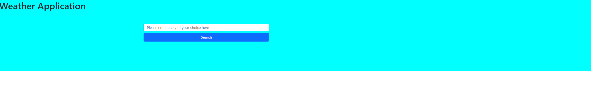

# <Challenge-6>

## Description

Provide a short description explaining the what, why, and how of your project. Use the following questions as a guide:

- The motivation for this project was to learn how to work with third party APIs and see how you are able to pull and push data from them. 
- I built this project to display the weather forcasts when someone types in a city in the search bar and is looking for the weather information.  
- What problem does it solve: allows the user to get real time weather data. 
The acceptance criteria is as follows:
GIVEN a weather dashboard with form inputs
WHEN I search for a city
THEN I am presented with current and future conditions for that city and that city is added to the search history
WHEN I view current weather conditions for that city
THEN I am presented with the city name, the date, an icon representation of weather conditions, the temperature, the humidity, and the the wind speed
WHEN I view future weather conditions for that city
THEN I am presented with a 5-day forecast that displays the date, an icon representation of weather conditions, the temperature, the wind speed, and the humidity
WHEN I click on a city in the search history
THEN I am again presented with current and future conditions for that city

- [Installation](#installation) N/A
- [Usage](#usage) N/A
- [Credits](#credits) None
- [License](#license) MIT

## Installation

Deployed on the github pages 

## Usage

Link to the website can be found here: https://bulkingfire.github.io/stathatos_Challenge6/
Screenshot:

## Credits

None

## License

MIT

---

🏆 The previous sections are the bare minimum, and your project will ultimately determine the content of this document. You might also want to consider adding the following sections.
